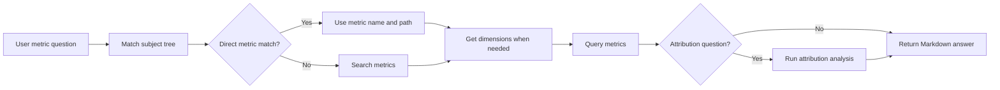

# AskMetrics Guide

## Overview

`ask_metrics` is a built-in metric question-answering subagent. It answers questions from existing semantic metrics instead of exploring raw tables or generating SQL.

Use AskMetrics when the user asks for:

- KPI values, such as "What was revenue last month?"
- Metric trends, such as "How did shipped quantity change by month?"
- Grouped metric results, such as "Revenue by region for Q1"
- Metric attribution, such as "Which customer segment drove the revenue drop?"

AskMetrics is intentionally narrow. If no existing metric can answer the question, it says so directly and does not fall back to raw SQL.

## Prerequisites

AskMetrics needs a configured semantic layer and published metrics.

Configure a semantic adapter in `agent.yml`. For example, MetricFlow:

```yaml
agent:
  services:
    semantic_layer:
      metricflow: {}
```

See [Semantic Layer Configuration](../configuration/semantic_layer.md) for full semantic adapter options.

Metrics can come from existing semantic-layer assets or from the [Generate Metrics](gen_metrics.md) subagent. With OSI, `ask_metrics` uses the same adapter tools but queries OSI-authored metrics through the configured execution backend. A metric subject tree is optional, but recommended because AskMetrics uses it as a routing catalog before searching.

## Quick Start

Start Datus with the datasource that owns the metrics:

```bash
datus --datasource production
```

Ask a metric question through the built-in subagent:

```bash
/ask_metrics What was total revenue last month by customer segment?
```

The main chat agent can also delegate to AskMetrics automatically through `task(type="ask_metrics")` when the question is metric-first. Web/API callers can route directly by using `subagent_id: "ask_metrics"`.

AskMetrics is scoped to the current datasource. If the user asks for another datasource, switch datasource first and ask again.

## How It Works

AskMetrics follows a metric-first workflow:



Key behavior:

- Direct subject-tree matches are preferred over search.
- `search_metrics` is used only when the subject tree is missing, partial, or ambiguous.
- `get_dimensions` is called before grouping, filtering, or attribution.
- `query_metrics` is the primary tool for metric values.
- `attribution_analyze` is used for change explanation and contribution questions.
- Raw SQL tools are not part of the default AskMetrics surface.

## Default Tools

| Tool | Purpose |
|------|---------|
| `context_search_tools.search_metrics` | Find candidate metrics when direct subject-tree matching is not enough |
| `context_search_tools.get_metrics` | Retrieve details for a known metric and subject path |
| `context_search_tools.list_subject_tree` | List metric subject paths when the startup subject tree is too large to inline |
| `semantic_tools.list_metrics` | Enumerate executable metrics from the semantic adapter |
| `semantic_tools.get_dimensions` | Discover valid dimensions for grouping, filtering, and attribution |
| `semantic_tools.query_metrics` | Query metric values |
| `semantic_tools.attribution_analyze` | Explain metric movement across candidate dimensions |

If the semantic adapter is unavailable, AskMetrics is unavailable because it cannot safely answer metric questions. If context search is unavailable, AskMetrics can still use semantic adapter tools, but it will not have subject-tree routing context.

## Output

AskMetrics returns a concise Markdown report with:

- the interpreted question and time range
- the metric names used
- the result values from metric tools
- attribution findings when attribution was run
- limitations when the question cannot be answered with existing metrics

It does not return raw SQL and does not invent metric values.

## Configuration

The built-in `ask_metrics` subagent works out of the box once the semantic adapter is configured. You can override model and turn budget:

```yaml
agent:
  agentic_nodes:
    ask_metrics:
      model: claude
      max_turns: 12
      semantic_adapter: metricflow
      subject_tree_prompt_limit: 100
```

### Custom AskMetrics Agents

Use `type: ask_metrics` to create a custom metric QA agent with its own name, prompt template, or tool allowlist:

```yaml
agent:
  agentic_nodes:
    sales_metric_qa:
      type: ask_metrics
      model: claude
      max_turns: 12
      prompt_version: "1.0"
      tools: "context_search_tools.search_metrics,context_search_tools.get_metrics,semantic_tools.get_dimensions,semantic_tools.query_metrics"
      subject_tree_prompt_limit: 50
      agent_description: "Answer sales metric questions using the sales semantic layer."
```

When `system_prompt` is omitted, Datus first looks for a prompt template matching the custom agent name, such as `sales_metric_qa_system_1.0.j2`, then falls back to the built-in `ask_metrics_system` template.

`tools` can be a comma-separated string or a list. The default surface is metric-focused. Custom agents can opt into other user-facing tool categories when needed, but keeping AskMetrics metric-only produces more deterministic answers.

## When Not To Use AskMetrics

Use another subagent when the task is not answerable through existing semantic metrics:

| Need | Use |
|------|-----|
| Generate new metric definitions from SQL | [gen_metrics](gen_metrics.md) |
| Generate or fix SQL over raw tables | [gen_sql](builtin_subagents.md#gen_sql) |
| Explore schemas, samples, or reference context | [explore](builtin_subagents.md#explore) |
| Build a visual report artifact | [gen_visual_report](gen_visual_report.md) |
| Create a dashboard in BI tools | [gen_dashboard](gen_dashboard.md) |
