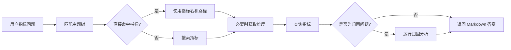

# AskMetrics 指南

## 概览

`ask_metrics` 是内置的指标问答 subagent。它基于已有语义指标回答问题，不探索原始表，也不生成 SQL。

适合使用 AskMetrics 的问题包括：

- KPI 数值，例如“上个月收入是多少？”
- 指标趋势，例如“发货数量按月如何变化？”
- 按维度分组的指标结果，例如“Q1 各地区收入”
- 指标归因，例如“哪个客户分群导致收入下降？”

AskMetrics 的能力边界刻意保持较窄。如果没有现有指标能够回答问题，它会直接说明原因，不会退回到原始 SQL 查询。

## 前置条件

AskMetrics 需要已配置的语义层和已发布的指标。

在 `agent.yml` 中配置语义层。以 MetricFlow 为例：

```yaml
agent:
  services:
    semantic_layer:
      metricflow: {}
```

完整配置见 [语义层配置](../configuration/semantic_layer.zh.md)。

指标可以来自已有语义层资产，也可以由 [Generate Metrics](gen_metrics.zh.md) subagent 生成。使用 OSI 时，`ask_metrics` 仍然使用同一组 adapter tools，但会通过配置的执行后端查询 OSI-authored metrics。主题树不是必需的，但建议使用，因为 AskMetrics 会先把主题树作为指标路由目录，再决定是否搜索指标。

## 快速开始

使用包含指标的 datasource 启动 Datus：

```bash
datus --datasource production
```

通过内置 subagent 提问：

```bash
/ask_metrics What was total revenue last month by customer segment?
```

主 chat agent 也可以在识别到 metric-first 问题时，通过 `task(type="ask_metrics")` 自动委派给 AskMetrics。Web/API 调用方可以使用 `subagent_id: "ask_metrics"` 直接路由。

AskMetrics 只作用于当前 datasource。如果用户询问其他 datasource，请先切换 datasource 再提问。

## 工作方式

AskMetrics 遵循 metric-first 工作流：



关键行为：

- 优先使用主题树中的直接指标匹配，而不是搜索。
- 只有在主题树缺失、不完整或存在歧义时才使用 `search_metrics`。
- 分组、过滤或归因前会先调用 `get_dimensions`。
- `query_metrics` 是查询指标值的主要工具。
- 变化解释和贡献分析问题使用 `attribution_analyze`。
- 默认工具面不包含原始 SQL 工具。

## 默认工具

| 工具 | 用途 |
|------|------|
| `context_search_tools.search_metrics` | 当主题树无法直接匹配时搜索候选指标 |
| `context_search_tools.get_metrics` | 获取已知主题路径和指标名的指标详情 |
| `context_search_tools.list_subject_tree` | 当启动时主题树过大、只能内联部分内容时列出指标主题路径 |
| `semantic_tools.list_metrics` | 从语义适配器列出可执行指标 |
| `semantic_tools.get_dimensions` | 发现可用于分组、过滤和归因的维度 |
| `semantic_tools.query_metrics` | 查询指标值 |
| `semantic_tools.attribution_analyze` | 按候选维度解释指标变化 |

如果语义适配器不可用，AskMetrics 会不可用，因为它无法安全回答指标问题。如果上下文搜索不可用，AskMetrics 仍可使用语义适配器工具，但不会有主题树路由上下文。

## 输出

AskMetrics 返回简洁的 Markdown 报告，包含：

- 解释后的问题和时间范围
- 使用的指标名
- 指标工具返回的结果值
- 执行归因时的归因结论
- 无法通过现有指标回答时的限制说明

它不会返回原始 SQL，也不会编造指标值。

## 配置

配置语义适配器后，内置 `ask_metrics` subagent 即可使用。你可以覆盖模型和轮数：

```yaml
agent:
  agentic_nodes:
    ask_metrics:
      model: claude
      max_turns: 12
      semantic_adapter: metricflow
      subject_tree_prompt_limit: 100
```

### 自定义 AskMetrics Agent

使用 `type: ask_metrics` 可以创建具有独立名称、提示词模板或工具 allowlist 的自定义指标问答 agent：

```yaml
agent:
  agentic_nodes:
    sales_metric_qa:
      type: ask_metrics
      model: claude
      max_turns: 12
      prompt_version: "1.0"
      tools: "context_search_tools.search_metrics,context_search_tools.get_metrics,semantic_tools.get_dimensions,semantic_tools.query_metrics"
      subject_tree_prompt_limit: 50
      agent_description: "Answer sales metric questions using the sales semantic layer."
```

如果省略 `system_prompt`，Datus 会先查找与自定义 agent 名称匹配的模板，例如 `sales_metric_qa_system_1.0.j2`，找不到时再回退到内置 `ask_metrics_system` 模板。

`tools` 可以是逗号分隔字符串，也可以是列表。默认工具面聚焦指标。自定义 agent 可以按需选择其他用户可见工具类别，但保持 AskMetrics 仅使用指标工具通常能得到更稳定的回答。

## 不适合使用 AskMetrics 的场景

当任务无法通过现有语义指标回答时，请使用其他 subagent：

| 需求 | 使用 |
|------|------|
| 从 SQL 生成新的指标定义 | [gen_metrics](gen_metrics.zh.md) |
| 生成或修复原始表 SQL | [gen_sql](builtin_subagents.zh.md#gen_sql) |
| 探索 schema、样本或参考上下文 | [explore](builtin_subagents.zh.md#explore) |
| 构建可视化报告 artifact | [gen_visual_report](gen_visual_report.zh.md) |
| 在 BI 工具中创建 dashboard | [gen_dashboard](gen_dashboard.zh.md) |
