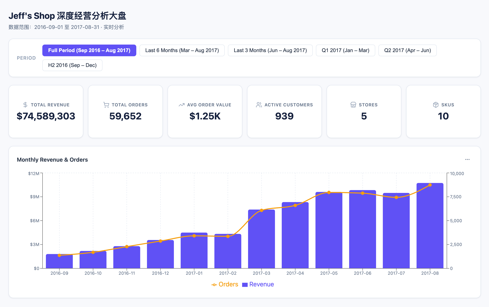
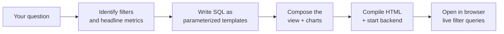

# HTML Dashboard Generation Guide

## Overview

`gen_visual_dashboard` turns a question — *"build me a store sales overview"*, *"show the new-user activation funnel"* — into a self-contained **HTML dashboard**: an interactive web page with filters, KPI cards, charts, and tables. Change a filter and the SQL re-runs against your database, the view refreshes on the spot. When the run finishes the page opens in your browser, served by a local `datus --web` backend.



An HTML dashboard is a **live data view** — every change to the date range, region, product line, or any other filter renders the saved SQL template with the new parameters and re-queries the database. That's the key difference from `gen_visual_report`, which bakes data into the page at build time: reports are for sharing in emails or briefings; dashboards are for the cases where you need to keep exploring or hand the page to someone who'll filter it themselves.

For interactive BI dashboards on Superset / Grafana, use [`gen_dashboard`](gen_dashboard.md) instead.

## Quick Start

First confirm `datus --web` is running locally — the dashboard's filters need this backend to answer queries:

```bash
uv run datus --datasource <your_datasource> --web
```

Activate `gen_visual_dashboard` as your current agent — the legacy `/gen_visual_dashboard ...` slash invocation was removed in favor of `/agent`-based selection:

```bash
/agent gen_visual_dashboard
```

(Or run `/agent` with no args to pick it from the unified agent TUI — Enter to edit, `s` to set as default.) Once active, just describe what you want — state the question, the filter dimensions you want, and the headline metrics:

```bash
Build a store sales overview dashboard. Support filtering by region and month, with GMV, order count, and AOV as the headline metrics.
```

```bash
Build a new-user activation funnel dashboard. Filter by acquisition channel and signup window, show signup → first-order → day-2 retention conversion.
```

To edit an existing dashboard, reference it by display name or by its short id:

```bash
Add an "AOV range" filter to dashboard store_sales_overview.
```

```bash
In "Store Sales Overview", switch the monthly aggregation to weekly.
```

Once the dashboard is built, the chat panel prints the HTML file's absolute path together with the `datus --web --datasource <ds>` command anyone else needs to run before opening that file — open the HTML in a browser and the dashboard is live. Closing and reopening it later requires no re-build.

## Start from a Metric or Your Own SQL

`gen_visual_dashboard` accepts two equally valid starting points:

- **From metrics** — reference an existing metric with `@Metrics <subject>.<group>.<metric>` (three segments — subject tree path + metric name). The agent will pull its definition, dimensions, and time windows from your semantic layer, and turn the dimensions into filters. Best when your project already has a curated metric registry (see [Generate Metrics](gen_metrics.md) for how to create them).
  ```bash
  Build an ops overview around @Metrics revenue.daily.dau and @Metrics conversion.weekly.signup_rate, with region and date-range filters.
  ```

- **From SQL** — paste the SQL you want the dashboard built on. The agent identifies the parameterizable conditions in it (date ranges, enum values, ID lists, …), promotes them to filters, and composes charts around the rest. Best for ad-hoc exploration or when the metric you need doesn't exist yet.
  ```bash
  Build a merchant reconciliation dashboard using this SQL, with the date range and store_id exposed as filters:
      SELECT trade_date, store_id, SUM(amount) AS gmv, COUNT(*) AS orders
      FROM mart.merchant_daily
      WHERE trade_date BETWEEN '2025-01-01' AND '2025-12-31'
      GROUP BY trade_date, store_id
  ```

You can also mix the two — point at a metric for the headline KPI and supply ad-hoc SQL for a specific drilldown or filter.

## How a Dashboard Gets Built



The agent reads your question, figures out which dimensions are filters and which signals are the headline metrics, writes each query as a parameterized Jinja2 template (a params declaration + the template body), and saves them under `dashboards/<slug>/` in your project. Once the HTML opens in the browser, every filter change POSTs to the local `datus --web` backend at `/api/v1/dashboard/query` — the backend renders the template into SQL, executes it, and the result hydrates the charts. The whole loop stays inside your environment; no data leaves it.

You can re-invoke `gen_visual_dashboard` later to edit the same dashboard in place.

## Edit Section by Section

Every dashboard is built out of independent modules — filters, individual charts, KPI cards, data tables. You can iterate on **just one** without touching anything else:

```bash
Change the AOV chart in store_sales_overview to a region-grouped bar chart
Add a "product category" filter to store_sales_overview
Drop the customer composition pie chart, it's not needed
Reorder the KPI cards so GMV comes first
```

Each call is a surgical change. The agent locates the affected module, edits it, rewrites only the SQL templates that changed, and leaves the rest of the layout, filters, and charts exactly as you reviewed them.

## What the Agent Has Access To

To build the dashboard, `gen_visual_dashboard` uses everything that's already wired into your project:

- **Your semantic layer** — defined metrics and dimensions take precedence over ad-hoc SQL whenever they fit the question; dimensions become filters directly.
- **Your databases** — the agent reads schema, samples values, and trial-runs the parameterized templates against your configured datasources to confirm they execute cleanly.
- **Your knowledge base** — curated reference SQL and business glossary entries are consulted before the agent writes anything from scratch.
- **Previous dashboards** — when you ask the agent to use an existing dashboard as inspiration, it can read that dashboard's filter layout and chart configuration.

You don't call any of this yourself — just write the prompt.

## Configuration

`gen_visual_dashboard` works out of the box; no configuration is required. The settings below are optional overrides in `agent.yml`:

```yaml
agent:
  agentic_nodes:
    gen_visual_dashboard:
      model: claude              # Optional: defaults to the configured model
      max_turns: 30              # Optional: defaults to 30
      web_host: localhost        # Optional: host baked into the HTML's query endpoint
      web_port: 8501             # Optional: port baked into the HTML's query endpoint
```

| Parameter | Required | Description | Default |
|-----------|----------|-------------|---------|
| `model` | No | LLM model to use | Configured default |
| `max_turns` | No | Maximum agent iterations before the run stops | 30 |
| `web_host` | No | Host baked into the HTML's filter-query endpoint | `localhost` |
| `web_port` | No | Port baked into the HTML's filter-query endpoint | `8501` |
| `query_endpoint` | No | Full URL override; takes precedence over `web_host` + `web_port` composition | Composed from `web_host` + `web_port` |

> When you share the generated HTML with someone else, they'll need to start the backend locally with the same `datus --web --datasource <ds>` command. If the host or port differs, update `web_host` / `web_port` in `agent.yml` accordingly — or set `query_endpoint` directly — so the URL baked into the HTML matches the actual backend.

## Tips for Better Prompts

You'll get a sharper dashboard when your prompt includes:

- **The scenario** — *"store sales overview"*, *"new-user activation funnel"*, *"merchant reconciliation"*.
- **The headline metrics** — *"GMV, order count, AOV"*, *"activation rate, retention rate"*.
- **The filter dimensions** — *"by region / by month"*, *"by channel / by signup window"*, *"by store_id"*.
- **The time window** — *"last 90 days"*, *"all of 2025"* (this also becomes the default value of the date-range filter).

If you skip any of these the agent will guess from your project's metrics and the SQL you gave it, and will only ask when intent is genuinely ambiguous.
