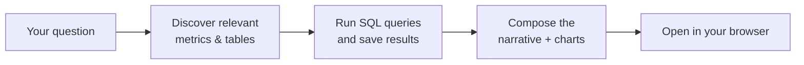

# HTML Report Generation Guide

## Overview

`gen_visual_report` turns a question — *"how did Q4 revenue do?"*, *"explain merchant churn in H2"* — into a self-contained **HTML report**: a scrollable web page with an executive summary, KPI cards, charts, tables, and narrative paragraphs. In Datus-CLI mode the page opens in your browser automatically; in Datus-SaaS it shows up inline in the chat.


An HTML report is a long-form, narrative answer with the data baked in at build time. There are no filters and no live re-querying once the report is built. For interactive BI dashboards on Superset / Grafana, use `gen_dashboard` instead.

If you'd rather have a plain-text **Markdown report** (no HTML rendering, no charts), use `/gen_report` instead.

## Quick Start

Just ask. State the question, the time window, and the breakdowns you care about:

```bash
/gen_visual_report Give me a Q4 2025 revenue report. Show monthly trend, top 10 regions, and a YoY comparison vs Q4 2024.
```

```bash
/gen_visual_report Analyze merchant churn for 2025 H2, segment by tenure bucket, and give key findings and recommendations.
```

To edit an existing report, reference it by display name or by its short id:

```bash
/gen_visual_report Add a channel-level breakdown table to report q4_2025_revenue_analysis.
```

```bash
/gen_visual_report In "Q4 2025 Revenue Analysis", switch the revenue trend chart to monthly aggregation.
```

## Start from a Metric or Your Own SQL

`gen_visual_report` accepts two equally valid starting points:

- **From metrics** — reference an existing metric with `@Metrics <subject>.<group>.<metric>` (three segments — subject tree path + metric name). The agent will pull its definition, dimensions, and time windows from your semantic layer. Best when your project already has a curated metric registry (see [Generate Metrics](gen_metrics.md) for how to create them).
  ```bash
  /gen_visual_report Build a Q4 2025 report around @Metrics revenue.daily.dau and @Metrics conversion.weekly.signup_rate, broken down by region.
  ```

- **From SQL** — paste the SQL you want the report built on. The agent treats your query as the data source, executes it, and assembles the narrative + charts around the result. Best for one-off analyses or when the metric you need doesn't exist yet.
  ```bash
  /gen_visual_report Build a churn report using this SQL:
      SELECT signup_month, tenure_bucket, churned_users
      FROM mart.churn_monthly
      WHERE signup_month >= '2025-07-01'
  ```

You can also mix the two — point at a metric for the headline KPI and supply ad-hoc SQL for a specific drilldown.

## How a Report Gets Built



The agent reads your question, looks up the metrics and tables that are most relevant, runs the SQL it needs, then composes the executive summary, KPI cards, charts, tables, and recommendations into a single HTML report. You can re-invoke `gen_visual_report` later to edit the same report in place.

## Edit Section by Section

Every report is built out of independent modules — KPI banner, individual charts, data tables, recommendations block, footer. You can iterate on **just one** without touching anything else:

```bash
/gen_visual_report Swap the revenue trend chart in q4_2025_revenue_analysis to monthly aggregation
/gen_visual_report Add a YoY column to the regional breakdown table
/gen_visual_report Drop the recommendations section, it's not needed for this audience
/gen_visual_report Update the executive summary to emphasize the H2 turnaround
```

Each call is a surgical change. The agent locates the affected module, edits it, re-runs only the queries that changed, and leaves everything else alone — so the rest of the layout, narrative, and figures stay exactly as you reviewed them. This makes the report cheap to iterate on: refine a wording, swap a chart type, add a column, or remove a section in a single back-and-forth, without ever rewriting the whole thing.

## What the Agent Has Access To

To build the report, `gen_visual_report` uses everything that's already wired into your project:

- **Your semantic layer** — defined metrics and dimensions take precedence over ad-hoc SQL whenever they fit the question.
- **Your databases** — the agent reads schema, samples values, and runs the queries against your configured datasources.
- **Your knowledge base** — curated reference SQL and business glossary entries are consulted before the agent writes anything from scratch.
- **Previous reports** — when you ask the agent to use an existing report as inspiration, it can read that report's data and components.

You don't call any of this yourself — just write the prompt.

## Configuration

`gen_visual_report` works out of the box; no configuration is required. The settings below are optional overrides in `agent.yml`:

```yaml
agent:
  agentic_nodes:
    gen_visual_report:
      model: claude              # Optional: defaults to the configured model
      max_turns: 30              # Optional: defaults to 30
```

| Parameter | Required | Description | Default |
|-----------|----------|-------------|---------|
| `model` | No | LLM model to use | Configured default |
| `max_turns` | No | Maximum agent iterations before the run stops | 30 |

## Tips for Better Prompts

You'll get a sharper report when your prompt includes:

- **The question** — *"explain merchant churn"*, *"compare Q4 revenue YoY"*.
- **The time window** — *"Q4 2025"*, *"last 90 days"*, *"2025 H2"*.
- **The scope** — region, segment, product line, or team.
- **The breakdowns you want** — *"by region"*, *"by tenure bucket"*, *"monthly trend"*.

If you skip any of these the agent will guess from your project's metrics and ask only when intent is genuinely ambiguous.
